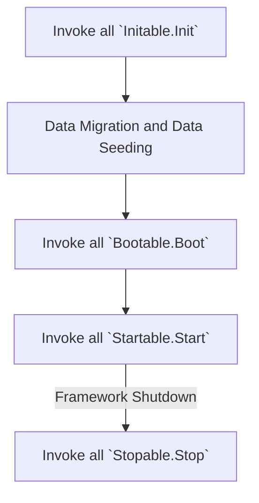

# module

In Zeddy, a module is the smallest unit that the framework can control.
When a struct implements the `github.com/zeddy-go/zeddy/app.Module` interface, it becomes a module.
The framework determines how to utilize a module based on whether it implements **specific** interfaces.
As for how to organize the content within the module, you have complete freedom to do so as you see fit.
Additionally, you are fully capable of writing the module as an independent `Go module` and importing it remotely when necessary.

The following code defines a module:
```go
import (
    "github.com/zeddy-go/zeddy/app"
)

type Module struct {
	app.Module
}
```

In `github.com/zeddy-go/zeddy/app/contract.go`, we have defined several interfaces that can be implemented for modules.
These interface methods are the means by which the framework interacts with the modules.
When the framework initializes, it iterates through all modules and attempts to invoke methods in the following order:


The `Init` method and `Boot` method are primarily for initializing the module, and splitting them into two methods is to reduce the dependency of each module on the execution order.

::: tip
The concept is straightforward: since the framework executes all `Init` methods before proceeding to the `Boot` methods, you should concentrate on binding the `New` methods of objects (commonly referred to as providers) in the `Init` methods that are executed earlier in the sequence. 
Then, in the `Boot` methods, which are executed later, you retrieve the necessary objects from the container to perform the corresponding operations.
This approach helps avoid issues that could arise from dependencies not being instantiated or having their `provider` not yet bound.
:::

::: danger
Attentive as you are, you should have noticed that dependencies between modules cannot be completely eliminated. 
For example, if the configx module is not executed first, other modules may report errors.
:::

`Start` and `Stop` are the places where blocking logic runs, such as starting an HTTP service.
Upon startup, the framework will execute all Start methods in a goroutine, and upon exit, the framework will execute all Stop methods, then wait for all Start methods to exit.

::: danger
Please ensure that your Start method can exit properly; otherwise, the framework will not be able to exit either.
:::

<style>
/* Set svg to center */
.mermaid svg {
    display: block;
    margin: auto;
}
</style>
