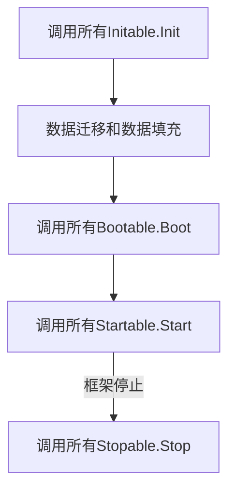

# 模块

在 zeddy 中，模块是框架能够控制的最小单位。 
当一个结构体实现了 `github.com/zeddy-go/zeddy/app.Module` 接口， 它就是一个模块了。 
框架会通过判断模块是否实现**特定的**接口来决定如何使用该模块。 
至于模块中的内容怎么组织，您完全可以自由发挥。
另外，您完全可以将模块作为独立的 `go模块` 编写，并在需要的时候从远程导入。

下面的代码定义了一个模块：
```go
import (
    "github.com/zeddy-go/zeddy/app"
)

type Module struct {
	app.Module
}
```
在 `github.com/zeddy-go/zeddy/app/contract.go` 中，我们为模块定义了一些可供实现的接口。
这些接口中的方法就是框架与模块互动的方式。
当框架启动时，会遍历所有模块，并按照如下顺序尝试调用方法。

`Init` 方法和 `Boot` 方法主要是对模块做初始化操作，分为两个方法是为了减少各个模块对执行顺序的依赖。

::: tip
这个思想很简单，因为框架会将所有 `Init` 方法都执行完成后才会继续执行所有 `Boot` 方法，
所以集中在执行顺序较靠前的 `Init` 方法中绑定对象的 `New方法` ( 也就是常说的 `provider` ) ，
而在顺序较靠后的 `Boot` 方法中从容器中取我们需要的对象来做相应操作。
这样就可以避免因为依赖的对象还没有被实例化或者根本就还没有绑定 `provider` 而导致的问题。
:::

::: danger
细心的您应该已经察觉到，各模块间的依赖并不能完全消除，例如 `configx` 模块不是第一个被执行，那么其他模块就有可能报错。
:::

`Start` 和 `Stop` 则是运行阻塞逻辑的地方，例如启动一个http服务。
启动时，框架会以协程方式执行所有 `Start` 方法，退出时，框架会执行所有 `Stop` 方法，
然后等待所有 `Start` 方法退出。

::: danger
请一定确保您的Start方法能正常退出，否者框架也无法退出。
:::

<style>
/* Set svg to center */
.mermaid svg {
    display: block;
    margin: auto;
}
</style>
